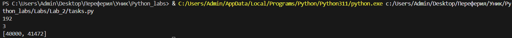

# Python. Лабораторная работа №2
## Расчётные задачи. itertools

### Условия задач

1. Ольга составляет таблицу кодовых слов для передачи сообщений, каждому сообщению соответствует своё кодовое слово. В качестве кодовых слов Ольга использует 4‑буквенные слова, в которых есть только буквы `A`, `B`, `C`, `D`, `X`, `Y`, `Z`. При этом первая буква кодового слова — это буква `X`, `Y` или `Z`, а далее в кодовом слове буквы `X`, `Y` и `Z` не встречаются. Сколько различных кодовых слов может использовать Ольга?

2. Значение арифметического выражения 


9<sup>8</sup> + 3<sup>5</sup> − 9


записали в системе счисления с основанием 3. Сколько цифр `2` содержится в этой записи?

3. Найдите все натуральные числа, принадлежащие отрезку `[40000; 50000]`, у которых ровно пять различных нечётных делителей (количество чётных делителей может быть любым). Выведите найденные числа в порядке возрастания.

### Описание проделанной работы

- Составлены функции для каждой задачи, решения оформлены в пакете `Lab_2`.
- Для первой задачи использован модуль `itertools` для генерации комбинаций с учётом ограничений.
- Второе задание сводится к вычислению выражения и переводу числа в тройичную систему, затем подсчёту цифр `2`.
- Третья задача решена перебором чисел от 40000 до 50000 с проверкой нечётных делителей.
- Для каждого алгоритма написаны **doctest**‑ы и дополнительно оформлен класс с методами, объединяющий логику.
- Запустил `pytest` для проверки модулей и doctest‑ов, все тесты прошли успешно.

### Доктесты

В исходных файлах функций добавлены примеры использования, проверяемые через `python -m pytest --doctest-glob='*.py'`.
Примеры выглядят примерно так:

```python
>>> count_code_words()
192

>>> count_twos_in_ternary()
3

>>> odd_divisors_count(45)  # 1, 3, 5, 9, 15, 45
6

>>> find_numbers_with_five_odd_divisors()
[40000, 41472]
```

### Скриншоты результатов



### Ссылки на используемые материалы

1. [Официальная документация itertools](https://docs.python.org/3/library/itertools.html)
2. [Документация по doctest](https://docs.python.org/3/library/doctest.html)
