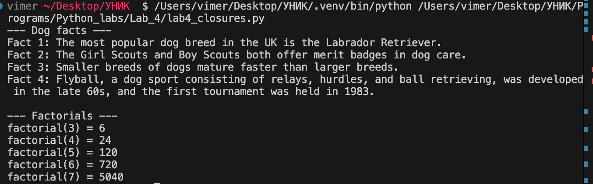

# Python. Лабораторная работа №4
## Замыкания

## Условия задач

### Сложность: Rare
Решите обе задачи своего варианта:
1. Замыкание для получения текста ответа на запрос к API (например, `https://dogapi.dog/api/v2/facts`).
2. Декоратор, ограничивающий частоту вызовов функций.

Дополнительно:
- Применить декоратор к замыканию.

### Сложность: Medium
- Создать декоратор с опциональным параметром.
- Продумать поддержку рекурсивных функций.

## Описание проделанной работы

- В файле `lab4_closures.py` реализован декоратор-функция `rate_limiter` с опциональными параметрами.
- Декоратор поддерживает рекурсивные функции: ограничение применяется только к внешнему (верхнему) вызову, внутренние рекурсивные вызовы не лимитируются.
- Реализовано замыкание `make_fetcher(url)`, которое:
  - хранит URL API во внешней области видимости;
  - запрашивает данные из API `dogapi.dog`;
  - возвращает текст факта о собаках;
  - декорируется `rate_limiter`, то есть к замыканию применён декоратор ограничения частоты.
- Для демонстрации реализованы функции:
  - `get_dog_fact()` — получение факта о собаке с ограничением частоты;
  - `factorial(n)` — рекурсивная функция с ограничением частоты вызова.
- В основной части программы выводятся результаты работы обеих функций.

## Скриншоты результатов



## Как запустить

- Запустите скрипт:
  ```bash
  python Programs/Python_labs/Lab_4/lab4_closures.py
  ```

## Ссылки на используемые материалы

1. [Python docs: decorators](https://docs.python.org/3/glossary.html#term-decorator)
2. [Python docs: functools](https://docs.python.org/3/library/functools.html)
3. [Python docs: contextvars](https://docs.python.org/3/library/contextvars.html)
4. [Python docs: urllib.request](https://docs.python.org/3/library/urllib.request.html)
5. [dogapi.dog](https://dogapi.dog/api/v2/facts)
