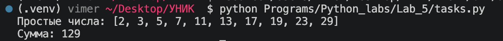
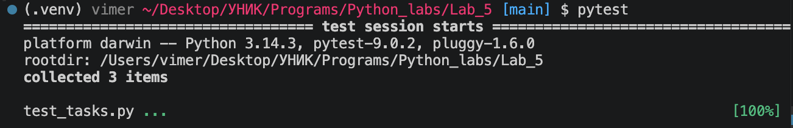

# Лабораторная работа №5: Генераторы

## Условия задач
1. Реализовать генератор простых чисел.
2. Просуммировать возвращаемые генератором числа.
3. Применить к генератору хотя бы одну из функций: `map`, `reduce`, `filter`.
4. Написать тесты с помощью `pytest`.

## Два уровня сложности
### Rare
- Генератор `prime_numbers(limit)` возвращает простые числа до `limit`.
- Использована функция `filter`.

### Medium
- Добавлены тесты `pytest` для проверки функции `is_prime` и генератора `prime_numbers`.
- Проверены случаи для `limit = 1`, `10`, `30`, `100`.

## Описание проделанной работы
1. Создана функция `is_prime(number)` для проверки простоты числа.
2. Создан генератор `prime_numbers(limit)` на основе `filter`.
3. Сумма простых чисел считается через `sum(prime_numbers(n))`.
4. Написаны тесты `pytest` в файле `test_tasks.py`.
5. Проверена корректность на нескольких значениях (`1`, `10`, `30`, `100`).

## Запуск
```bash
python Programs/Python_labs/Lab_5/tasks.py
pytest
```

Ожидаемый результат:
```text
Простые числа: [2, 3, 5, 7, 11, 13, 17, 19, 23, 29]
Сумма: 129
...                                                                      [100%]
3 passed in 0.01s
```

## Скриншоты результатов




## Ссылки на используемые материалы
1. [Документация Python](https://docs.python.org/3/)
2. [filter](https://docs.python.org/3/library/functions.html#filter)
3. [sum](https://docs.python.org/3/library/functions.html#sum)
4. [pytest](https://docs.pytest.org/)
