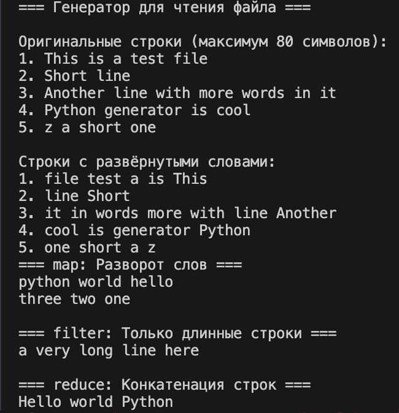
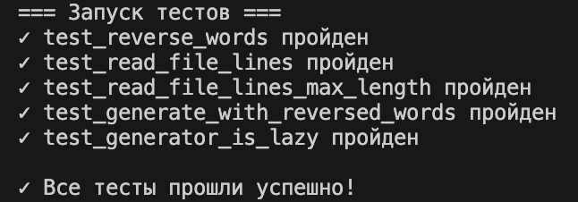
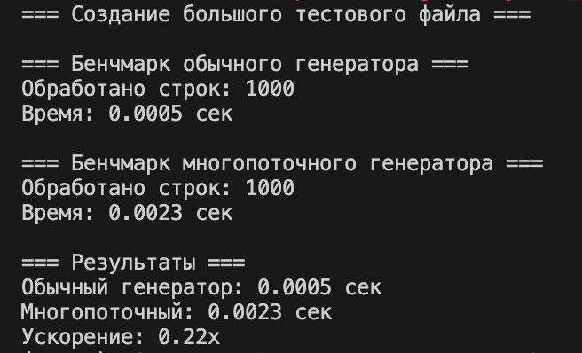

# Python. Лабораторная работа №5
## Генераторы

## Условия задач

### Сложность: Rare
Решите задачу своего варианта:
- Генератор для построчного чтения файла.
- Если длина строки превышает заданный предел — возвращает подстроку допустимого размера.
- Переверните слова в строках, возвращаемых генератором.
- К генератору должна быть применена хотя бы одна из функций `map`, `reduce`, `filter`.

### Сложность: Medium
- Напишите для генератора тесты.

### Сложность: Well-done
- Реализуйте многопоточную/параллельную версию генератора.
- Продемонстрируйте повышение производительности относительно исходной версии.

## Описание проделанной работы

### Основной генератор (`generators.py`)

1. **`read_file_lines(filename, max_length=80)`** — базовый генератор:
   - Читает файл строка за строкой.
   - Если длина строки > `max_length`, обрезает до нужного размера.
   - Возвращает страки через `yield` (ленивое вычисление).

2. **`reverse_words(line)`** — функция разворота слов:
   - Разбивает строку на слова.
   - Разворачивает их в обратном порядке.
   - Объединяет обратно.

3. **`generate_with_reversed_words(filename, max_length=80)`** — комбинированный генератор:
   - Использует `read_file_lines` и `reverse_words`.
   - Возвращает строки с развёрнутыми словами.

4. **Применение `map`, `filter`, `reduce`**:
   - `map`: применяем `reverse_words` к спискам строк.
   - `filter`: отбираем только длинные строки (> 10 символов).
   - `reduce`: конкатенируем строки в одну.

### Тесты (`test_generators.py`)

Пять простых тестов:
- `test_reverse_words()` — проверка разворота слов.
- `test_read_file_lines()` — проверка чтения файла.
- `test_read_file_lines_max_length()` — проверка ограничения длины.
- `test_generate_with_reversed_words()` — проверка комбинированного генератора.
- `test_generator_is_lazy()` — проверка ленивого вычисления.

### Многопоточная версия (`multithreaded_generators.py`)

- `multithreaded_generator()` — многопоточная реализация.
- Один поток читает файл, другой обрабатывает.
- Используется `Queue` для передачи данных между потоками.

### Скриншот результатов





## Как запустить

```bash
# Основной генератор
python3 generators.py

# Тесты
python3 test_generators.py

# Многопоточная версия и бенчмарк
python3 multithreaded_generators.py
```

## Ключевые концепции

- **Генератор** — функция с `yield`, которая возвращает значения по одному.
- **Ленивое вычисление** — данные вычисляются только когда их запрашивают.
- **`map`** — применяет функцию к каждому элементу.
- **`filter`** — отбирает элементы по условию.
- **`reduce`** — объединяет элементы в один результат.
- **Многопоточность** — параллельное выполнение задач для повышения производительности.

## Ссылки на используемые материалы

1. [Python docs: Генераторы](https://docs.python.org/ru/3/howto/functional.html#generators)
2. [Python docs: map, filter, reduce](https://docs.python.org/3/library/functions.html#map)
3. [Python docs: functools.reduce](https://docs.python.org/3/library/functools.html#functools.reduce)
4. [Python docs: threading](https://docs.python.org/3/library/threading.html)
5. [Python docs: queue.Queue](https://docs.python.org/3/library/queue.html)
