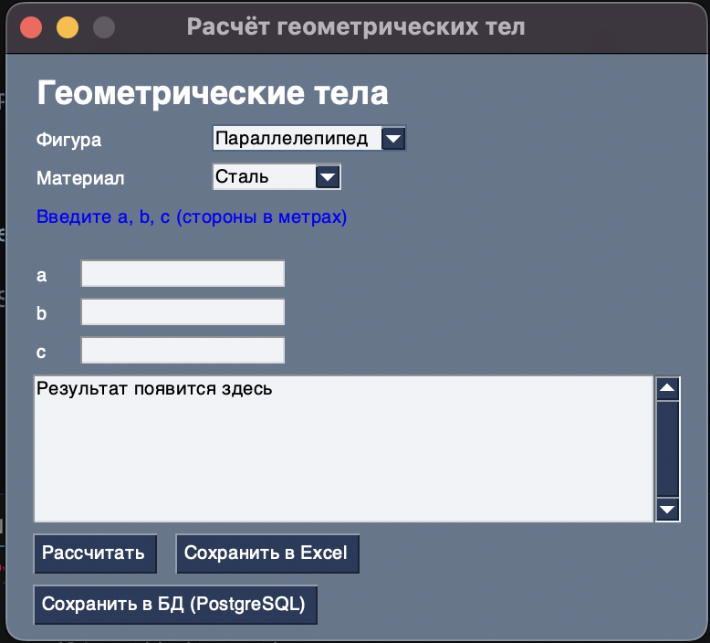

# Лабораторная работа №7 — Модули и пакеты

## Условия задач

Реализовать расчёт параметров геометрических тел (параллелепипед, тетраэдр, шар):
- **Объём**
- **Площадь поверхности**
- **Масса** (в зависимости от материала)

Доступные материалы и их плотности (кг/м³):

| Материал  | Плотность |
|-----------|-----------|
| Сталь     | 7800      |
| Алюминий  | 2700      |
| Медь      | 8900      |
| Дерево    | 600       |
| Пластик   | 1200      |

---

## Структура проекта

```
Lab_7/
├── geometry/               ← пакет с 3 модулями
│   ├── __init__.py
│   ├── parallelepiped.py   ← Модуль 1: параллелепипед
│   ├── tetrahedron.py      ← Модуль 2: тетраэдр
│   └── sphere.py           ← Модуль 3: шар
├── main.py                 ← главная программа (PySimpleGUI GUI)
├── exporter.py             ← сохранение в Excel
├── database.py             ← работа с PostgreSQL (Medium)
├── docker-compose.yml      ← запуск БД в Docker (Medium)
└── requirements.txt
```

---

## Описание проделанной работы

### Пакет `geometry`

Пакет реализован в объектно-ориентированном стиле:
- абстрактный базовый класс `GeometryBody` (`abc.ABC`, `@abstractmethod`),
- иерархия наследования (`GeometryBody` → `SingleParameterBody`/`TripleParameterBody` → конкретные фигуры),
- managed-атрибуты через `@property` + setter с валидацией,
- общие методы для расчёта массы и переиспользуемой валидации параметров.

**`parallelepiped.py`** — класс `Parallelepiped`, принимает стороны `a, b, c`:
$$V = a \cdot b \cdot c \qquad S = 2(ab + bc + ac)$$

**`tetrahedron.py`** — класс `Tetrahedron`, принимает ребро `a`:
$$V = \frac{a^3}{6\sqrt{2}} \qquad S = \sqrt{3}\,a^2$$

**`sphere.py`** — класс `Sphere`, принимает радиус `r` (передаётся как параметр `a`):
$$V = \frac{4}{3}\pi r^3 \qquad S = 4\pi r^2$$

Масса во всех случаях: $m = \rho \cdot V$

### Графический интерфейс (PySimpleGUI)

`main.py` строит интерфейс на PySimpleGUI:
- `Combo` — выбор фигуры (`Параллелепипед`, `Тетраэдр`, `Шар`) и материала
- `Input` — три поля ввода `a`, `b`, `c`; для тетраэдра и шара используются только `a`, поля `b`, `c` блокируются
- Подсказка под спиннером фигуры меняется при смене фигуры
- Валидация: перед расчётом проверяется, что все введённые значения являются числами
- `Button «Рассчитать»` — вычисляет объём, площадь и массу, выводит результат
- `Button «Сохранить в Excel»` — доступна всегда
- `Button «Сохранить в БД (PostgreSQL)»` — появляется **только** если при запуске удалось импортировать `database.py` (т.е. БД доступна)

### Сложность Rare — сохранение в Excel

`exporter.py` использует `openpyxl==3.1.2`. При первом сохранении создаётся файл `results.xlsx` с заголовками; каждый следующий результат добавляется новой строкой. Значения объёма, площади и массы сохраняются **округлёнными** до целых.

### Сложность Medium — PostgreSQL в Docker

| Переменная    | По умолчанию  |
|---------------|---------------|
| `DB_HOST`     | `localhost`   |
| `DB_PORT`     | `5433`        |
| `DB_NAME`     | `geometry_db` |
| `DB_USER`     | `user`        |
| `DB_PASSWORD` | `password`    |

---

## Запуск

```bash
# 0. Создать виртуальное окружение на совместимом Python (пример для 3.9)
python3.9 -m venv .venv
source .venv/bin/activate

# 0.1 (только macOS + Homebrew Python 3.9) установить tkinter
brew install python-tk@3.9

# 1. Установить зависимости
python -m pip install -r requirements.txt

# 2. (Medium) Запустить PostgreSQL в Docker
docker compose up -d

# 3. Запустить приложение
python main.py
```

---

## Просмотр результатов в БД

Перейдите в папку проекта и подключитесь к PostgreSQL:

```bash
cd '/Users/vimer/Desktop/УНИК/Programs/Python_labs/Lab_7'
docker compose exec db psql -U user -d geometry_db
```

Внутри консоли psql:

```sql
-- Посмотреть все записи
SELECT * FROM results;

-- Выйти
\q
```

> Важно: команду нужно запускать именно из папки `Lab_7`, где находится `docker-compose.yml`, иначе docker compose не найдёт конфигурацию.

---

## Скриншоты результатов



---

## Используемые материалы

- [Документация PySimpleGUI](https://pysimplegui.readthedocs.io/)
- [openpyxl](https://openpyxl.readthedocs.io/)
- [psycopg](https://www.psycopg.org/psycopg3/docs/)
- [Docker Compose](https://docs.docker.com/compose/)
- Формулы: [Wikipedia — Тетраэдр](https://ru.wikipedia.org/wiki/Тетраэдр), [Wikipedia — Шар](https://ru.wikipedia.org/wiki/Шар)
